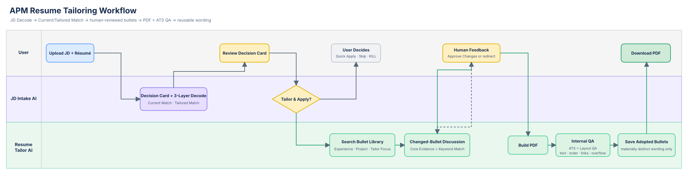

# APM Resume Tailor Skills

> Decide first. Discuss only the bullets that matter. Approve once, then receive a validated PDF.

Two lightweight Agent Skills for APMs, product managers, and adjacent product roles:

| Skill | What it does | Output |
|---|---|---|
| `pm-jd-intake` | Decodes the JD and judges whether truthful tailoring is worth the time | Decision Card, Current/Tailored Match, three-layer Decode, route |
| `resume-tailor` | Maps requirements to verified evidence and proposes only changed content | Core Evidence Changes, Keyword Match, internal QA, PDF |



## How it works

```text
Upload JD + résumé
→ Suggested Decision + three-layer Decode
→ Tailor & Apply / User Decides / Quick Apply / Skip / KILL
→ changed-bullet discussion when tailoring is worthwhile
→ approve all displayed changes
→ internal Preview QA
→ downloadable PDF
```

Every route shows the full three-layer Decode. Strong/Direct projected matches with real tailoring value continue automatically into bullet discussion. Medium or low-upside roles stop so the user can decide. Weak or ineligible roles do not consume tailoring time.

## Quick install

```bash
git clone https://github.com/Saun321/apm-resume-tailor-skills.git
cd apm-resume-tailor-skills

# Codex
cp -R skills/pm-jd-intake ~/.codex/skills/
cp -R skills/resume-tailor ~/.codex/skills/

# Claude Code
cp -R skills/pm-jd-intake ~/.claude/skills/
cp -R skills/resume-tailor ~/.claude/skills/
```

For another Agent-Skills-compatible tool, copy both folders into its skills directory.

For a friend-ready starter that needs only a résumé and JD, download [`dist/APM-Resume-Tailor-Friend.zip`](dist/APM-Resume-Tailor-Friend.zip). It contains a Chinese guide and swimlane plus the English Skill and Bullet Design reference; examples explicitly forbid copying their facts or metrics into another person's résumé.

## First run

Only a current résumé and complete JD are required:

```text
Use $pm-jd-intake to compare my attached résumé with this complete JD.
Show Suggested Decision first, then the full three-layer Decode.
If Tailored Match can become Strong or Direct and the changes are worthwhile, continue to $resume-tailor automatically.
```

The Tailor returns only changed bullets and keyword/Skills adjustments. Reply with `approve all`, edit a specific bullet, request a different direction, or add evidence. Once every displayed change is approved, the skill runs Preview QA internally and generates the PDF when rendering tools are available.

For a fresh conversation, save the Intake handoff using `skills/pm-jd-intake/references/run-template.md`, then prompt:

```text
Use $resume-tailor with this handoff. Show Core Evidence Changes and Keyword Match only. After I approve all displayed changes, run internal Preview QA and generate the PDF.
```

## Inputs

| Input | Required? | Purpose |
|---|---|---|
| Complete JD | Yes | Requirements, eligibility, and role context |
| Current résumé | Yes | Recruiter-visible evidence and default structure |
| Verified evidence | Optional | Additional interview-defensible facts for Tailored Match |
| Approved Bullet Library | Optional | Reuses accepted wording; never acts as a fact source |
| Editable résumé template | Optional | Enables preview and PDF generation in supported environments |

No Story Bank or experience archive is required. Supplemental claims remain `verified`, `user-confirmed`, or `unverified`. Unverified evidence, planned learning, upgraded ownership, and invented metrics never enter the score or résumé.

## Output design

### Intake

1. Suggested Decision with Current and Tailored Match.
2. JD quotes translated into hiring capabilities.
3. One Requirement Scorecard covering Must, Nice, and Hidden Signals.
4. Company and product research focused on the PM's actual product area.

### Tailoring

1. Core Evidence Changes mapped to M/N/H requirements.
2. Keyword Match with discussion-only `<keyword>` markers.
3. One approval for all displayed changes.
4. Internal layout QA and direct PDF delivery.

The skills preserve truthful ownership, scope, metrics, causality, delivery state, and the uploaded résumé structure by default. They never submit an application.

## Repository structure

```text
skills/
├── pm-jd-intake/
│   ├── SKILL.md
│   ├── agents/openai.yaml
│   └── references/
│       ├── decode-patterns.md
│       ├── match-rubric.md
│       ├── output-template.md
│       └── run-template.md
└── resume-tailor/
    ├── SKILL.md
    ├── agents/openai.yaml
    ├── scripts/run-lock.mjs
    └── references/
        ├── bullet-policy.md
        ├── evidence-policy.md
        └── layout-policy.md

docs/
└── apm-resume-tailor-flow.{drawio,svg}
```

## Limitations

PDF rendering depends on tools available in the agent environment. If rendering is unavailable, the skill returns the approved changed content and explains what is missing instead of pretending a PDF exists. Match scores support prioritization and do not guarantee interviews.

## Acknowledgment

The simple two-skill packaging was inspired by [vignzpie/resume-agent-skills](https://github.com/vignzpie/resume-agent-skills).

## License

MIT
