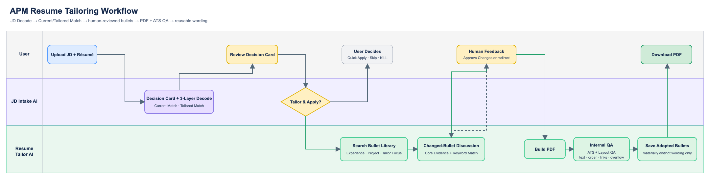

# APM Resume Tailor 好友分享版

这套 Skill 先通过 JD Decode、Current Match 和 Tailored Match 判断岗位是否值得认真 tailor，再只讨论真正需要改变的 bullet。你反馈并确认全部改动后，AI 会生成 PDF、执行 ATS 与版面检查，并把最终采用的优质 bullet 存入可复用 Bullet Library。



## 你需要准备什么

只需两项输入：

1. **当前简历**：PDF、DOCX、HTML、Markdown 或纯文本都可以。
2. **完整 JD**：直接粘贴全文，或上传包含完整职位描述的文件。

不需要提前整理经历库。若 AI 发现关键证据缺失，你可以在讨论时补充真实经历。

## 开始使用

把 `apm-resume-tailor` 文件夹复制到支持 Agent Skills 的工具中，然后上传简历并使用这段提示词：

```text
Use $apm-resume-tailor. My current résumé is attached and the complete JD is below.
Show Suggested Decision first, then the full three-layer Decode.
If truthful tailoring can reach Strong or Direct Match, continue to changed-bullet discussion automatically.
```

如果工具不能安装 Skill，也可以把 `apm-resume-tailor/SKILL.md` 和 `references/bullet-design.md` 一起交给 AI 阅读后执行。

## 你会看到什么

1. **Suggested Decision**：是否值得 tailor、Current Match 和 Tailored Match。
2. **三层 Decode**：JD 真正需要什么、逐项得分、公司与产品背景。
3. **Changed Bullets**：只展示建议修改的 bullet 和 Skills，不重复整份简历。
4. **Internal QA + PDF**：确认改动后检查页数、行数、粗体、链接与文字可复制性，再生成 PDF。
5. **Bullet Library**：只保存最终采用、显著不同、可直接进入 résumé 的 bullet，供下一份 JD 优先检索与复用。

## 如何和 AI 讨论 bullet

`【Point Change】` 下一行就是需要你验收的候选 bullet，中间不会留空行。

关键词变化会显示为 `<keyword>`。尖括号只用于让你快速看到改了哪里，最终简历会删除尖括号，只保留关键词。

你可以回复：

- `approve all`：接受全部改动并继续生成 PDF；
- 指定某条 bullet 修改措辞或强调方向；
- reject 某个方向并让 AI 换一种写法；
- 补充真实经历，再让 AI 只更新受影响的部分。

## 文件说明

- `apm-resume-tailor/SKILL.md`：英文执行流程。
- `apm-resume-tailor/references/bullet-design.md`：英文 bullet 写作与验收规则。
- `apm-resume-tailor/references/bullet-library.md`：英文 Bullet Library 格式、检索与保存规则。
- `workflow.png`：中文简化泳道图。
- `workflow.drawio`：可编辑的 draw.io 源文件。

## 边界

- Skill 不会编造 ownership、scope、指标、因果关系或上线状态。
- 示例只用于学习结构，不能把示例中的公司、项目、事实或数字复制到你的简历。
- Bullet Library 只保存表达，不是事实来源；每次复用仍需核对当前简历或已确认经历。
- Match 只用于申请优先级判断，不保证获得面试。
- Skill 不会自动投递职位，也不会在没有真实文件时假装已经生成 PDF。
